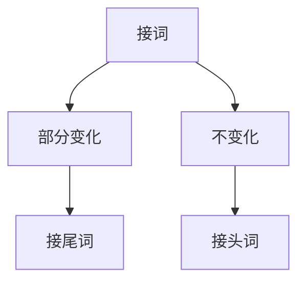
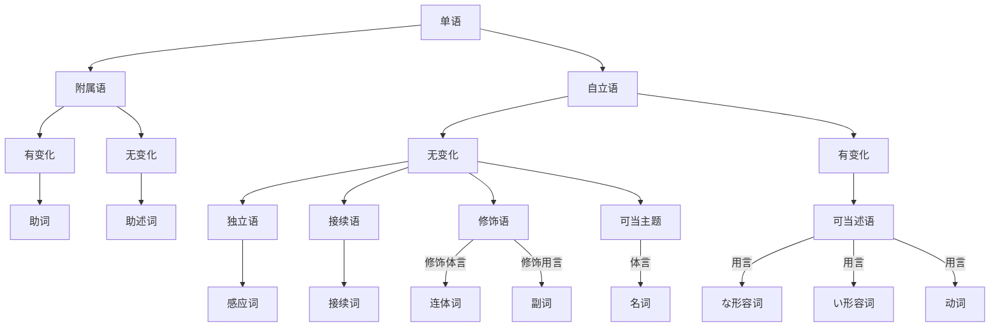

# C1
## 日语分解
单文: 类似英语的简单句，只有一个动词(述语)
e.g. 私はいつも日本語を**研究しています**
复文: 类似英语的复合句，有多个述语
e.g. 時間が**あったら**、いつも日本語**研究しています**

节即小句，比如上面例子的前半句为从属节(从句)，后半句为主节(主句)

## "语"分类
日语中"文"(类似句子)由主题、修饰语、补足语、述语 构成，也可能有表达感叹/应答的独立语，或数个"文"之间的接续语
述语表达核心文意，通常在句尾: 为 动词/い形容词/な形容词/名词(+助述词)
桜が(补足语)咲きました(述语)
高橋さんは(主题)　とても(修饰语)　綺麗です(述语)
某些副词+助述词也可以成为述语
大学入学試験は　もうすぐ(副词)です(助述词)

补足语: 名词+助词，补充光有述语时不够清楚的文意
体言: 文の本体を表す言葉: 表示句子本体的言语，即名词
用语: 文の作用を表す言葉: 表示句子的作用的言语，即可以作为述语的动词，形容词

修饰语: 多样地描述述语/补足语的程度/状态/...
英語が　少し　わかります
英語が　全然　わかりません

修饰补足语: 如形容修饰名词
修饰修饰语: 如副词修饰形容词
可以分类为修饰体言/用言
大きな->夢が　あります
ご飯を　たくさん->食べました

主题vs主语
主题: 文的描述内容的范围; 主语: 一定是述语状态的主题
桜は綺麗です
主题: 由は提示的"桜は"，文 描述的内容"很漂亮"的范围
主语: 述语"綺麗です"的状态主题，仍然是"桜は"
象は　鼻が　長いです
主题: 由は提示的"象は"，文 描述的内容"鼻子很长"的范围
主语: 述语"長いです"的状态主题，即"鼻が"而不是"象は"

和英语不同，日语中省略主语非常自然
どこへ行きますか
面对面时经常会省略あなたは

雨だ(It rains)
8時ですよ(It's 8 o'clock). 
在英语中需要用it来补全缺失的主语，日语(和中文)则不需要
同样，主题也不是必须的，描述眼前的时候不需要提示主题

独立语：和上下文没有关联的语
位于句首，表示感叹应答，比如はい/こんにちは这种，也可以放一个名词，比如
お金、... 表示as for money

接续语: 连接两个文。表示文/单语之间的关系
* テストの時は 鉛筆 を使ってください。**または**、ボールペん でもいいです
* テストの時は 鉛筆 **または** ボールペン を使ってください

接续语大全:
* 顺接/因为
  * だから
  * それで
  * そのため
  * そこで
* 逆接/但是
  * しかし
  * ところが
  * でも
  * それでも
* 反效果/反而
  * むしろ
  * かえって
* 转换话题/那么
  * それでは
  * では
  * さて
  * ところで: 话说
* 表结论/总之
  * 結局: 最后
  * このように: 就像那样
  * とにかく: 总之，反正
* 换一种说法/换句话说
  * つまり
  * すなわち
  * 要するに
* 否定修正/与其...不如说
  * むしろ
  * というか: 该说是...还是
* 例子/例如
  * 例えば
  * いわば
  * 特に: 特别是
* 补充/此外
  * なお
  * ただし: 但是
  * もっとも: 话虽如此
  * ちなみに: 顺带一提
* 说明前面内容/是因为
  * 何故なら
  * というのは
  * だって
* 并列/以及
  * また
  * 並びに
  * および
  * かつ
* 累加/再加之
  * そして
  * それに
  * しかも
  * それから
* 对比/反过来说
  * 一方(いっぽう): 另一方面
  * 逆に: 反过来说
  * 反対に: 相反地
* 选择/或者
  * または
  * それとも
  * もしくは
* 列举/首先
  * 第一に
  * まず
  * 次に: 下一个

并立语: 主题的并立
*太郎と*花子はご飯を食べた = 太郎は... 花子は...
xxxと 是表示并立的助词，类似"and"。很类似地有"友達とブスで学校へ行く"，此处类似"with"，是补足语

一个语分类如果有多个文节的组合，就称为"部"。前面的例子主题是*太郎と*和*花子*的组合，是"主题部"
うちは*狭くて汚い*
上述标出的部分是"述部".

### 从"语"到"部"
**この会社**はとても大きいです
句中加粗部分为主题部，不能认为"会社"单独为主题。

このケーキを**食べて見てください**
句中加粗部分为述部。"見て": 为补助动词，此处意思是尝试。"ください": 也是补助动词，为くださいませ(くださいます的命令形)省略后的形式

### 品词分类
语分类: 单语在特定句子里面"扮演的角色"，也就是主谓宾
词分类: "演员"，也就是单词本身的词性

系统图(非常复杂)

图相关解释: 
日语中的最小单位可以分成单语和接词。NLP中称为morpheme。中文为单个汉字，英语为词的部分
接词单独存在没有意义，必须结合其他单语出现
* 接头: 如"お金"的"お"
* 接尾: 如"山田さん"的"さん"

附属语: 单独存在时不能确定意义，比如が, は, の, です。必须在单语后面，成组出现，比如背が,子は,姉の

