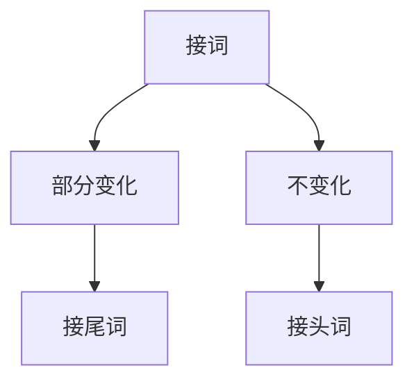
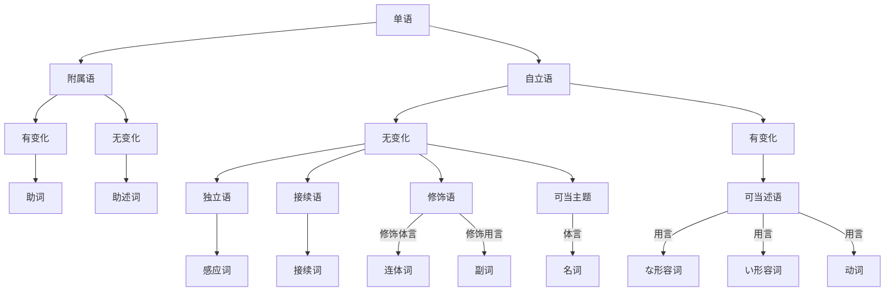

# C1
## 日语分解
单文: 类似英语的简单句，只有一个动词(述语)
e.g. 私はいつも日本語を**研究しています**
复文: 类似英语的复合句，有多个述语
e.g. 時間が**あったら**、いつも日本語**研究しています**

节即小句，比如上面例子的前半句为从属节(从句)，后半句为主节(主句)

## "语"分类
日语中"文"(类似句子)由主题、修饰语、补足语、述语 构成，也可能有表达感叹/应答的独立语，或数个"文"之间的接续语
述语表达核心文意，通常在句尾: 为 动词/い形容词/な形容词/名词(+助述词)
桜が(补足语)咲きました(述语)
高橋さんは(主题)　とても(修饰语)　綺麗です(述语)
某些副词+助述词也可以成为述语
大学入学試験は　もうすぐ(副词)です(助述词)

补足语: 名词+助词，补充光有述语时不够清楚的文意
体言: 文の本体を表す言葉: 表示句子本体的言语，即名词
用语: 文の作用を表す言葉: 表示句子的作用的言语，即可以作为述语的动词，形容词

修饰语: 多样地描述述语/补足语的程度/状态/...
英語が　少し　わかります
英語が　全然　わかりません

修饰补足语: 如形容修饰名词
修饰修饰语: 如副词修饰形容词
可以分类为修饰体言/用言
大きな->夢が　あります
ご飯を　たくさん->食べました

主题vs主语
主题: 文的描述内容的范围; 主语: 一定是述语状态的主题
桜は綺麗です
主题: 由は提示的"桜は"，文 描述的内容"很漂亮"的范围
主语: 述语"綺麗です"的状态主题，仍然是"桜は"
象は　鼻が　長いです
主题: 由は提示的"象は"，文 描述的内容"鼻子很长"的范围
主语: 述语"長いです"的状态主题，即"鼻が"而不是"象は"

和英语不同，日语中省略主语非常自然
どこへ行きますか
面对面时经常会省略あなたは

雨だ(It rains)
8時ですよ(It's 8 o'clock). 
在英语中需要用it来补全缺失的主语，日语(和中文)则不需要
同样，主题也不是必须的，描述眼前的时候不需要提示主题

独立语：和上下文没有关联的语
位于句首，表示感叹应答，比如はい/こんにちは这种，也可以放一个名词，比如
お金、... 表示as for money

接续语: 连接两个文。表示文/单语之间的关系
* テストの時は 鉛筆 を使ってください。**または**、ボールペん でもいいです
* テストの時は 鉛筆 **または** ボールペン を使ってください

接续语大全:
* 顺接/因为
  * だから
  * それで
  * そのため
  * そこで
* 逆接/但是
  * しかし
  * ところが
  * でも
  * それでも
* 反效果/反而
  * むしろ
  * かえって
* 转换话题/那么
  * それでは
  * では
  * さて
  * ところで: 话说
* 表结论/总之
  * 結局: 最后
  * このように: 就像那样
  * とにかく: 总之，反正
* 换一种说法/换句话说
  * つまり
  * すなわち
  * 要するに
* 否定修正/与其...不如说
  * むしろ
  * というか: 该说是...还是
* 例子/例如
  * 例えば
  * いわば
  * 特に: 特别是
* 补充/此外
  * なお
  * ただし: 但是
  * もっとも: 话虽如此
  * ちなみに: 顺带一提
* 说明前面内容/是因为
  * 何故なら
  * というのは
  * だって
* 并列/以及
  * また
  * 並びに
  * および
  * かつ
* 累加/再加之
  * そして
  * それに
  * しかも
  * それから
* 对比/反过来说
  * 一方(いっぽう): 另一方面
  * 逆に: 反过来说
  * 反対に: 相反地
* 选择/或者
  * または
  * それとも
  * もしくは
* 列举/首先
  * 第一に
  * まず
  * 次に: 下一个

并立语: 主题的并立
*太郎と*花子はご飯を食べた = 太郎は... 花子は...
xxxと 是表示并立的助词，类似"and"。很类似地有"友達とブスで学校へ行く"，此处类似"with"，是补足语

一个语分类如果有多个文节的组合，就称为"部"。前面的例子主题是*太郎と*和*花子*的组合，是"主题部"
うちは*狭くて汚い*
上述标出的部分是"述部".

### 从"语"到"部"
**この会社**はとても大きいです
句中加粗部分为主题部，不能认为"会社"单独为主题。

このケーキを**食べて見てください**
句中加粗部分为述部。"見て": 为补助动词，此处意思是尝试。"ください": 也是补助动词，为くださいませ(くださいます的命令形)省略后的形式

### 品词分类
语分类: 单语在特定句子里面"扮演的角色"，也就是主谓宾
词分类: "演员"，也就是单词本身的词性

系统图(非常复杂)

图相关解释: 
日语中的最小单位可以分成单语和接词。NLP中称为morpheme。中文为单个汉字，英语为词的部分
接词单独存在没有意义，必须结合其他单语出现，结合完还是单语
* 接头: 如"お金"的"お"
* 接尾: 如"山田さん"的"さん"

附属语: 单独存在时不能确定意义，比如が, は, の, です。必须在单语后面，成组出现，比如背が,子は,姉の
和接词不同，结合完变成文节而不是单语。
分为
* 助词：跟在单语后面，没有形式变化，表示所附属的语在句子中的含义，比如が(焦点)、は(主题)、の(所属)
* 助述词：跟在"用言"/"体言"后面，形成"述部"，有形式(过去/否定)变化，比如です

名词接助述词可以作为述语，比如だ, です, である

动词分类: 
* 动作/状态
* 瞬间/持续
* 意志/非意志
* 自动/他动
* I/II/III类

动作性名词：后加「します」后可以作为动词使用
部分单语既是名词又是な形容词，比如「健康」

副词放在修饰的用言前面，不需要紧跟，但距离太远可能让文意变得难理解
少数情况下，副词也可以修饰用言之外的内容
図の位置は*もっと***右**です (修饰名词)
*とても***ゆっくり**歩いています (修饰副词)
*たぶん*、山田さんはお盆休みはどこも行かないで家でゆっくり過ごすでしょう (修饰「文」)
ゴルフクラブの握り方は*こう*です (作为述语，(像)这样)

连体词，顾名思义即修饰体言(名词)的词，一定会和名词一起出现
これ、*ほんの***気持**ちです (这是一点点的心意)
*大きな***夢**を持っています

不需要紧跟修饰的体言，但不能距离太远
*あの*赤い**シャツ**を見せてください

これ、それ、あれ是名词，この、その、あの是连体词
大きい是形容词，可以单独出现；大きな是连体词，必须跟名词

连体词本身没有否定/过去形式，必须通过接续的名词来表现变化
私の会社は**大きくない**です
私の会社は**大きな***会社じゃありません*

需要区分な形容词和连体词，虽然「大きな」修饰名词结尾也有な，但他是连体词！去掉な后，「大き」本身不是合法单语

很多接续词是由其他品词衍生来的
* 动词: 従います(随着)->したがって(因此)
* 名词: 一方(一方面)->一方(另一方面)
* 名+助: おまけ(附加)＋に 再加上
* 名(指示)+助: それ＋から 还有，然后
* 副(指示)+助: そう＋して 然后
* 功能相当于接续词的接续部: それに対して 相对地

接续词可以表示前一个文和后一个文的关系，也能表示单语之间的关系
* 今日の午後3時に来てください。**または**、明日の朝10時でもいいです
* 試験の日は、鉛筆**または**ボールペンを用意してください

助词中的接续助词和并立助词与接续词功能类似

接续助词连接的是一个文中的不同节(接续词连接的是不同文)
* 日本の寿司は美味しい**けれど**、値段が高いです
* 風邪をひいた**ので**、会社を休みます

有的词既可以当接续助词，又可以当接续词，比如「けれど」
* 日本の寿司は美味しいです。けれど、値段が高いです

前面提到接续词也可以表示单语之间的关系，类似的，并立助词
* 試験のひは鉛筆**か**ボールペンを用意してください (か: 表示“或者”的并立助词)

感应词/感叹词: 可以放在开头/单独使用。招呼用于也算感应词
* 惊讶: え！富士山が噴火したの？ 
* 意外: おお、結構美味しいですね
* 不满: えー、今日の花火大会は中止になったの？
* 同意: はい、私もそう思います
* 不同意: いいえ、違います
* 叫唤: あのう、この写真をちょっと見てほしいんだけど。
* 引起注意: さあ、そろそろ行くよ
* 疑问: あれ？ここに置いてあった本は...
* 感叹: ああ、何で美しい人だ
* 振奋: よし！頑張るぞ。
* 招呼用语: こんにちは、元気ですか

助述词/助动词: 辅助述语形成复杂述部的词
最重要的为接续在名词后面的だ、です、である，即**判定助述词**，表示肯定/断定。
这三者后面搭配形式名词，比如の、こと、もの、よう、わけ、はず、つもり等，就会形成新的助述词

助词接续在单语后面，表示在「文」中的意义关系

助词整理
* は
  * 提示主题
  * 区别，对比
* も
  * 也，同上/同前
  * 强调程度(多用于数量词后)
* の
  * 所属，所产，所有，所载
* が
  * 格助词，表示主体
  * 接续助词，逆接
  * 终助词，用于前言/开场白，或表示微弱的主张
* を
  * 作用对象
  * 移动/经过/离开的点
* に
  * 动作进行时点
  * 着点: 
    * 动作对象
    * 存在位置
    * 到达点
    * 进入点
    * 最终出现地点/集合点
    * 最终停留地点
    * 接触点
    * 频率/分配的分母
  * 方面(对...来说)
  * 目的
  * 结果
  * 原因(不常用) 
* で
  * 范围
    * 动作进行地点
    * 动作主体单位
    * 述语/述部的言及范围
  * 所需的数量/限度
  * 方法
    * 移动的手段
    * 工具/手段
    * 制造的材料(made of)
  * 以...名义
  * 运动时的样态
  * 原因/理由
* と
  * 提示所说/所思考的内容
  * 提示一起动作的对象
  * (并立助词)列举事物(全部)
* へ
  * 移动/行为的方向
* から
  * 起点
    * 空间上的起点
    * 东西/动作的顺序
    * 动作的授予方(可更换为に)
    * 动作的主体
    * 变化的起点
    * 原料(made from)
    * 最小值
  * 原因
    * (接续助词)原因
    * 判断依据
* まで
  * 终点
    * 终点
    * 到达点
    * 最大值
* より
  * 比较
    * 比较的基准
    * 限定，唯一选择
  * 起点，经过点(=から，常用于书面)
* か
  * 疑问: 疑问、反问、自问
  * 提议
  * 感叹
* ね
  * 要求同意/表示同意
  * 确认
  * 柔和语气
  * 表示话没说完
  * 感叹
* よ
  * 提醒、通知
  * 劝诱
  * 感叹
  * 呼唤
  * 表示无所谓、不感兴趣

##### は
主题$=$主语: 
* このコピー機**は**壊れています

主题$\neq$主语: 
* この弁当**は**妻が作りました
* 荷物**は**ここに置いてください

对比
* 果物をよく食べますが、りんご**は**嫌いです

##### も
也/同上
A: じゃあ、僕はカレーライス。
B: 僕**も**。

注意も的位置会影响语义
* 彼女**も**北海道で蟹を食べました (其他人吃了，她也吃了)
* 彼女は北海道で**も**蟹を食べました (她在别的地方吃了，在北海道也吃了)
* 彼女は北海道で蟹**も**食べました (她吃了别的，也吃了螃蟹)

表示程度，一般接续在数量词后面，强调主观上的"超越一般状况"
* 財布の中に十万円**も**あります
* みかんを七つ**も**食べました

##### の
连体修饰，用于名词修饰名词时，表示所属/所有/所在等关系，可能有多义
* これが高橋さん**の**写真です (高桥所拍的/所有的/所被拍的...照片，和中文的"的"类似)

##### が
格助词，接续在名词后，表示名词和述语之间的关系

述语/述部的主体是主语。而「が」是表示主体的格助词。
当主语=主题时，使用助词「は」。使用が/は强调的东西不同

使用が表示述语的焦点，明确传达出内容
* 神戸の夜景**が**綺麗です

が作为接续助词，表示逆接
* お寿司は美味しいです**が**、高いです

が作为终助词，表示前言，常用于开场白
* 三岡商事の山本です**が**、原田課長はいらっしゃいますか

也可以表示微弱的主张
* A：いつになったら円安になりますか。　B：う〜ん、円高はしばらくづつく続くと思います**が**
* あれ？部屋には誰もいないはずだ**が**

##### を
表示作用对象，搭配他动词
* お湯**を**沸かします (お湯是结果目的语，和中文"烧开水"一样，开水是结果，烧的是水)
* 穴**を**掘ります

除了实体对象，也可以是意识情感对象
* 図書館の電話番号**を**知っています

表示移动，经过的点
* 公園**を**散歩します
* 橋**を**渡ります

离开的点
* バス**を**降ります
* 大学**を**卒業します

表示方向
* 後ろ**を**振り向きます
* 上**を**向いて歩きます

##### に
表示动作的进行时点
* 8月**に**日本へ行きます

着点1: 动作的对方
* 私は高橋さん**に**電話をかけました
* 私は母**に**叱られました (被动文)
* 私は息子**に**日本語を勉強させます (使役文)

着点2: 存在位置
* 壁**に**カビが生える
* 私**に**は子供が二人います (抽象概念的存在位置)

着点3: 移动的到达点
* 今、東京駅**に**着きました
* 富士山**に**登ります

着点4: 进入点
* バス**に**乗ります
* 教室**に**入ります

着点5: 动作的最终出现地点或集合地点
* 細い道をまっすぐ行くと、大きな道**に**出た
* 会議**に**出席します
* 運動場**に**集まってください

着点6: 动作的最终停留地点
* 机の上**に**資料を置きます
* 車を駐車場**に**止めます

着点7: 接触点
* 頭を壁**に**ぶつけました
* 公園で友達**に**会いました (抽象的动作接触点)

着点8: 频率/分配分母
* １週間**に**何回日本語を勉強しますか
* 一人**に**三本配ります

方面: 关于某一方面的内容，对...来说
* このカバンは出張**に**便利だ
* タバコは体**に**良くない
* 娘は私**に**似ている

目的: 动作的目的
* フランスへデザインの勉強**に**行きたい

结果: 动词变化的结果/决定的结果
* 信号が赤**に**なりました
* 今日の晩ご飯はカレー**に**しましょう

原因: 表示原因/理由(少见，常用で)
* 貧困**に**苦しむアフリカの子供だち

##### で
范围1: 动作的进行地点
* 図書館**で**レポートを書きました
* 昨晩、ここ**で**交通事故がありました (交通事故包含"动作的概念")

范围2: 动作的主体单位
* 家族**で**ハワイへ旅行に行った
* 自分**で**勉強しました
* 一人**で**学校へ行きます
* 送料は弊社の方**で**負担します

范围3: 述语/述部的言及范围
* スポーツ**で**何が一番好き**で**すか
* 全部**で**五百円**で**す

所需数量/限度
* ここから新宿駅ま**で**二十分**で**行けますか
* ビール2杯**で**頭がふらふらになる
* 今日はこれ**で**終わりましょう

方法1: 移动的手段
* 昨日はタクシー**で**家へ帰りました
* 日本からアメリカま**で**飛行機**で**12時間かかります

方法2: 手段/工具
* 合否の結果は郵便**で**お知らせします
* 日本人は箸**で**ご飯を食べます

方法3: 制造某物用的**材料**(保留原本性质，made of)
* ガラス**で**作った靴

名义: 以...的名义
* サービス**で**これをつけます

样态: 运动时的样态
* 裸足**で**砂浜を走ります

原因，理由
* 台風**で**電車が止まりました
* 風邪**で**１週間休みました

##### と
提示所说的内容/所思考的内容
* 先生は明日テストがある**と**言っていました
* あそこに駐車禁止**と**書いてありますよ

Remark: 一般格助词的定义是，名词+格助词 形成 补足语，表示名词和述语间的关系。但**と**可以接续在「节」的后面，形成引用节

提示对象
* 私は友達**と**海へ行きました
* A国はB国**と**一緒に戦った (此句中，因为有一緒に，所以应该理解成AB两国联手。否则的话也可以解读为A和B相互打)
* 彼女は小野さん**と**結婚しました
* 実際は写真**と**全然違いました

(并立助词)列举事物
* 休みの日は土曜日**と**日曜日です
* かばんの中に鉛筆**と**ノートがあります

**と**表示列举出全部的事物，や表示列举部分，即A and B and etc.
* かばんの中に鉛筆やノート(など)があります

##### へ
移动，行为方向
* 明日、病院**へ**行きます
* 母**へ**の手紙

##### から
起点1: 空间上的起点，经过的点
* 大阪**から**東京まで飛行機で何時間かかります
* 学校は家**から**近いところにあります
* 正門は人が多いので、裏門**から**入りましょう

起点2: 顺序
* いつも好きなもの**から**食べます (东西的顺序)
* (接续助词，前用て形)手を洗って**から**ご飯を食べましょう(动作的顺序)

起点3: 动作的授予方
* 私は友達**から**プレゼントをもらいました (可以更换为に)
* 彼はたくさんの人**から**尊敬させています (被动，可以更换为に)

起点4: 动作的主体
* この件についてはあなた**から**彼に伝えてください

起点5: 变化
* 信号が赤**から**青になりました
* 所沢駅で電車**から**バスに乗り換えていく

起点6: 原料(made from)
* 豆腐は大豆**から**作られます
* ワインは葡萄**から**作られます

起点7: 最小值
* 安いものは千円**から**ありますよ
* 身長は2メートル**から**ある大男

原因1: 原因(接续助词)
* 日本のドラマが好きです**から**、日本語を勉強します
* タバコの不始末**から**火事になりました (直接放在名词/形式名词后)
* 六本の松の木あったこと**から**六本木と呼ばれるようになりました

原因2: 判断依据
* この状況**から**判断すると、明日の試合は中止になりそうだ

##### まで
终点1: 终点
* 8時から10時**まで**日本語を勉強します

终点2: 到达点
* 駅**まで**迎えに行きますから、待っていてください
* 困ったことがあれば、係員**まで**ご連絡ください

终点3: 最大值
* この図書館では一人四冊**まで**借りられます
* ここにあるワイン、百万円のもの**まで**ある

##### より
比较1: 比较的基准:
* 北海道は九州**より**大きいです
* 猫**より**犬の方が好きです

比较2: 限定，唯一选择
* 手術**より**他に助かる方法はありません

起点，经过点(=から)，常用于书面
* 本日**より**十周年記念セールを行います
* 武田軍は西門**より**城内へ侵入した

以下三个为终助词
##### か
疑问1: 疑问(语调上扬)，出现在节的末尾形成疑问节(名词性从句)时不需要改变语调
* 彼がどこに住んでいる**か**知りません

疑问2: 反问(语调上扬)
* そんな簡単に成功すると思っているんです**か**

疑问3: 自问(语调正常)
* そろそろ寝る**か**

疑问4: 提议，劝诱。动词现在否定形+**か** 或 动词意向形+**か**
* 一緒に帰ろう**か**
* コーヒーでも飲みません**か** (上扬)

感叹(语调不上扬)
* A: 日本語検定試験に合格しました B: そうです**か**。すごいですね

##### ね
要求对方同意或表示同意
* A: この料理美味しい**ね** B: そうだ**ね**。美味しい**ね**

再确认
* 確かあなたは埼玉県出身でした**ね**

亲近、柔和，缓和语气
* その時計、とても素敵です**ね**
* みんなは賛成しているけど、私は賛成できない**ね**

留住注意，表示话还没说完
* 昨日**ね**、友達と遊びに行ったんだけど**ね**

感叹(敬佩，惊讶)
* 独学でよく一級試験に合格した**ね**

##### よ
提醒，通知，劝诱
* もう8時です**よ**。起きてください (语调上扬)
* あなたの傘、ここにありました**よ** (语调上扬)
* ね、映画を見に行こう**よ** (劝诱，语调不上扬)

感叹，用于对方没自觉的事情，表达激昂的情绪
* 泣かないで、君はよく頑張った**よ**

呼唤
* 若者**よ**、今こそ立ち上がれ

看淡，无所谓，不感兴趣
* もう恋愛なんかどうでもいい**よ**

### 接辞
接头
* *お*金: 郑重
* *お*忙しい: 郑重
* *ご*ゆっくり: 郑重
* *ぶっ*壊す: 强调
* *大*企業: 程度

接尾
* 山田*さん*: 郑重
* 安心*感*: 感觉
* 私*たち*: 复数
* 靴*屋*: 营业形态
* 三*人*: 人数

有些接辞回改变单语原本的品词，成为「转成」

接尾:
* さ: 表示程度，形容转名
  * 大きい　大きさ
  * 華やか　華やかさ
* たて: 表示阶段，刚...的，动转名
  * 焼きます　焼きたて
* らしい: 表示风格，像...的，名转い形
  * 男　男らしい
* にくい: 表示难易，难...的，动转い形
  * 歩きます　歩きにくい
* がち: 表示频率，经常...的，名转な形
  * 病気　病気がち
* そう: 样态，好像...的，い形转な形
  * 美味しい　美味しそう
* がる: 样态，似乎...，い形转动
  * 欲しい　欲しがる
* びる: 样态，像...，名转动
  * 大人　大人びる

接头
* 無: 表达否定 
  * 無関心
  * 無表情
  * 無(ぶ)愛想・不愛想
  * 無(ぶ)作法・不作法

### 次要的品词分类
指示词
"\~ちら"和"\~っち"可以指人/事物/地方
| 意义 | 指(事物) | 指(事物) | 指(地方) | 指(郑重) | 指(口语) | 这样 | 这样的 | 
|:----:|:-------:|:-------:|:-------:|:------:|:-------:|:---:|:------:|
| こ系列 |これ |この  |ここ  　|こちら  |こっち  |こう |こんな  |
| そ系列 |それ |その  |そこ 　 |そちら  |そっち  |そう |そんな  |
| あ系列 |あれ |あの  |あそこ  |あちら  |あっち  |ああ |あんな  |
| ど系列 |どれ |どの  |どこ　  |どちら  |どっち  |どう |どんな  |
| 品词 | 名 | 连体   |名     |名    |名     |副  | 连体  |

(ど系列都是疑问词)

指示词搭配其他单语构成的指示词
* ＋いう (连体): こういう、そういう、ああいう、どういう 
* ＋ような (连体): このような、そのような、あのような、どのような
* ＋ように (副): このように、そのように、あのように、どのように

疑问词
疑问文可以分为三种
* 真伪: 回答是/否
* 选择: 从两个以上的选项做出选择
* 疑问: 使用疑问词

例
* この本は**何**の本ですか
* あの人は**誰**ですか
* トイレは**どこ**にありますか
* **いつ**日本へ来ましたか
* **どうして**日本語を勉強していますか

数量词
数量词是在数字后面的接尾辞，用来表示数量、
* りんごを**五つ**書いました
* 日本に来て**八ヶ月**です

时间词
与时间相关的单语
* 来年、日本へ行きます
* 私は八月に日本へ行きます

# C2
述语的特征
* 文的核心角色
* 出现在文末(句尾)
* 动词、い形、な形、名词(+助述词)

少数情况下副词+助述词也可以当述语
* オリンピック開催まであと少しです
* ゴルフクラブの握り方はこうです

述语的基本四变化: 现在肯定/现在否定/过去肯定/过去否定

下面是丁寧語的四变化
* 动词: 〜ます、〜ません、〜ました、〜ませんでした
* い形容詞: 〜いです、〜くないです、〜かったです、〜くなかったです
* な形容詞・名詞: 〜です、〜じゃありません、〜でした、〜じゃありませんでした

## 动词变化
II类: え/い段+る
III类: 来る　する
其他为I类

动词形式:
| 学习顺序 | 动词变化 | 
|:------:|:--------:|
| 初尝试         | ます |
| 开始          |　て |
| 前期(N5)      |　辞書形、ない、た、なかった |
| 后期(N4)      | 命令，禁止，意向，条件，可能，受身，使役 |
| 基本日语能力完成 | 尊敬 |